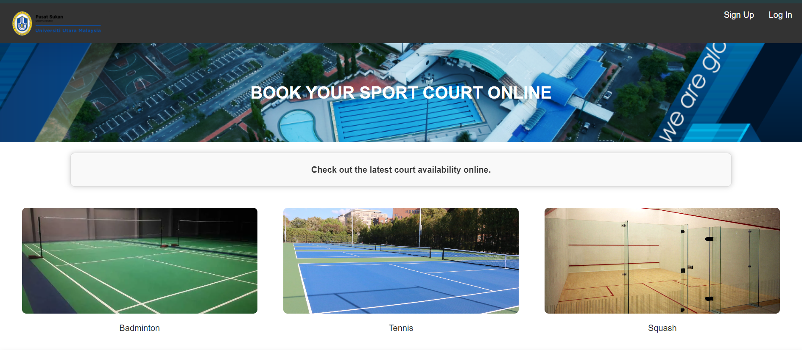

# Sport Court Reservation System for UUM

## Introduction

The Sport Court Reservation System for Universiti Utara Malaysia (UUM) is designed to streamline the process of booking sports courts, making it easier for students to find and reserve courts that fit their schedules. This system also aims to reduce the workload of staff involved in managing reservations manually. The system currently supports the reservation of badminton courts, tennis courts, and squash courts. It offers distinct functionalities for users and administrators to ensure efficient management and user experience.

## Project Structure

### User Functions

1. **Booking Court:**
    - **Badminton Court**
    - **Tennis Court**
    - **Squash Court**
   
   Users can search for available slots and reserve courts for their preferred times.

2. **Manage Booking:**
    - **Edit Reservation:** Users can change the date or time of their existing reservations.
    - **Cancel Reservation:** Users can cancel their reservations if they no longer need the court.

3. **Check Timetable of Court:**
    - **Weekly Timetable:** Users can view the availability of courts for the upcoming week.
    - **Advance Booking:** Users can book courts up to 7 days in advance.

4. **Manage Profile:**
    - Users can update their profiles, including setting different titles and levels to indicate their proficiency in the sport (e.g., beginner, intermediate, advanced).

### Administrator Functions

1. **Manage Courts:**
    - Administrators can add, edit, or remove court availability.
    - Administrators can view and manage all bookings.

2. **Manage Users:**
    - Administrators can add, edit, or remove user profiles.
    - Administrators can oversee user activity and booking history.

3. **Reports and Analytics:**
    - Generate reports on court usage.
    - Analyze booking patterns to optimize court allocation.

4. **Competition Management:**
    - Organize competitions and events.
    - Set competition details including title, level, date, time, host name, and venue.
    - Manage participant registration and match schedules.

## Timetable and Booking Restrictions

- **Advance Booking:** Users are allowed to book courts up to 7 days in advance to ensure fair access to facilities.
- **Timetable View:** Both weekly and daily views are available for users to check the availability of the courts.

## Additional Features

- **User Sign-Up and Authentication:**
    - Secure user registration and login processes to protect user information and ensure only authorized access.

- **Payment Integration:**
    - Users can make payments for their reservations through integrated payment gateways.

- **Search Functionality:**
    - Users can search for available courts based on date, time, and type of court.

- **Responsive Design:**
    - The system is designed to be accessible on various devices, including desktops, tablets, and mobile phones.

## Technologies Used

- **Frontend:**
    - HTML, CSS, JavaScript for building the user interface.
    - React.js for a dynamic and responsive user experience.

- **Backend:**
    - Node.js for handling server-side logic.
    - phpMyAdmin, PHP for the database to manage user data, court availability, and bookings.

- **Tools:**
    - Git for version control.
    - API testing.
